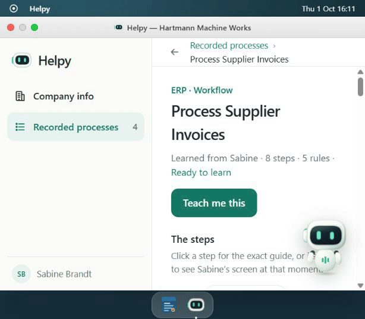
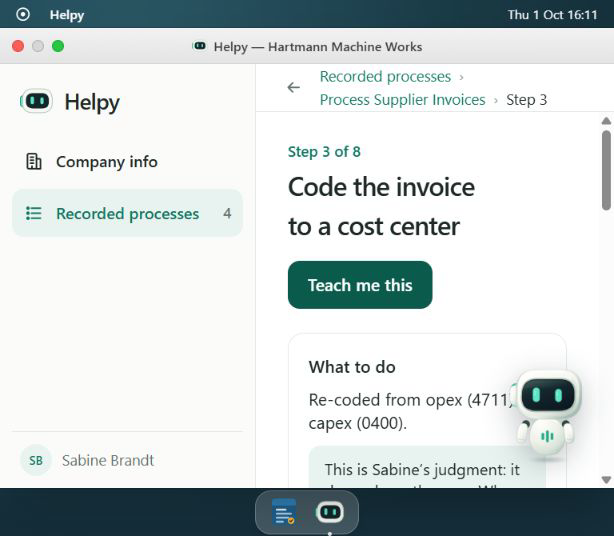
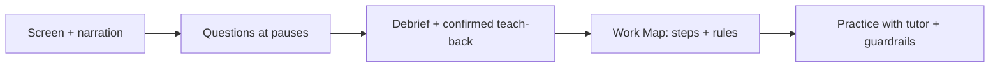

# Helpy

**Turn an expert's everyday work into guidance the next person can use.**

[](LICENSE)


Helpy watches screen activity and listens to narration, asks questions during pauses, and turns the expert's decisions into a Work Map with steps, rules, and reasons. A new hire can practice with a voice tutor and checks that catch mistakes before posting in the demo ERP.

[Quick start](#quick-start) · [Demo walkthrough](DEMO_SCRIPT.md) · [Architecture](docs/ARCHITECTURE.md)

## Why Helpy?

The most important parts of a workflow often live in someone's head: why an invoice is held, when a second approval is needed, or which exception changes the usual rule. Writing those details down interrupts the expert, and static documentation becomes outdated. Helpy learns while the expert works, then checks its understanding with follow-up questions and a confirmed teach-back. The goal is to preserve judgment alongside the steps.

## Demo



*A 12-second screen tour captured from the running app. These views use the built-in, hand-written example process, not an AI-generated recording.*



For a quick look, open Helpy → **Recorded processes** → **Process Supplier Invoices**. Open a step to see its guide and decision tree. **Teach me this** starts practice in ProcureFlow; invoice 5102 tests whether equipment over €5,000 is coded as capex. The example has no recorded screen replay.

The [seven-minute demo script](DEMO_SCRIPT.md) covers live Capture → Map → Teach, including pause, debrief, correction, and a mistake caught before saving.

## How it works



Screenshots pass through local OCR and PII redaction before vision inference. See the privacy limitations below.

## Key features

- Screen and microphone recording with an off-the-record pause and a screenshot timeline.
- Contextual voice questions that wait while the expert types or talks.
- English/German OCR and voice interaction.
- Browser-side PII detection and synthetic replacements in screenshots.
- Work Maps with steps, expert reasoning, decision trees, and links to recorded screen moments when available.
- Debrief questions, corrections, and confirmation of Helpy's explanation.
- Guided invoice practice with pre-save guardrails, hints, and a learning report.
- Workflow export for another AI agent to follow.

## Privacy / Safety

**Use synthetic demo data. This prototype has public access and mock sign-in, not authentication or project authorization.**

- Original screenshots, original OCR text, redacted screenshots, and microphone recordings are stored in Convex. Local deployments store them on the local backend; cloud deployments upload them to that deployment. Anyone with a file URL can download it.
- Vision inference receives redacted screenshots. OCR/redaction can miss sensitive content, and recognized demo business identifiers are intentionally retained. Processing failures can still leave an original screenshot stored.
- Voice features send microphone audio to ElevenLabs; AI features send screen context and workflow content to Anthropic. Speech text has limited redaction for emails, bank/card details, and phone numbers; names in speech are not redacted.
- Pause stops new screen capture and pauses microphone recording/Scribe streaming. Previously captured data can continue processing. Keep the recording tab open until saving finishes.
- First-use OCR/redaction assets download from external CDNs and Hugging Face. The AI/voice loop requires internet and provider credentials.

See [recording, storage, and access details](docs/ARCHITECTURE.md#task-recording) before using private workflows.

## Tech stack

React 19 · TypeScript · TanStack Start/Router/Query · Vite · Tailwind CSS · Convex · Anthropic · ElevenLabs · Tesseract.js · Desert Ant Labs Redact (LiteRT).

## Quick start

Requires **Node.js 22.12+**, npm, and internet for initial dependency/model downloads.

```sh
git clone https://github.com/maxRN/helpy.git
cd helpy
npm ci
npm run dev:convex
```

Choose **develop locally without an account** when prompted. Keep that terminal running: Convex writes the public backend URL to ignored `.env.local` and persists local data in `.convex/`.

In a second terminal:

```sh
npm run dev
```

Open [localhost:3000](http://localhost:3000). The built-in example lets you inspect the workflow and guides without AI keys. Live capture requires Chrome/Edge, **Entire Screen** sharing, microphone permission, and ready OCR/redaction models.

For the full AI/voice demo, copy `.env.example` to `.env` and set `ANTHROPIC_API_KEY` and `ELEVENLABS_API_KEY`. Configure the interviewer/tutor agents with:

```sh
node scripts/create-elevenlabs-agents.mjs
```

Copy the returned agent IDs into `ELEVENLABS_AGENT_INTERVIEWER` and `ELEVENLABS_AGENT_TUTOR` in `.env`; restart the app. The script creates or updates agents in your ElevenLabs account. Provider usage may incur charges. Optional voice/model overrides are documented in `.env.example`. Never prefix secret keys with `VITE_` or commit `.env`.

## Architecture

The browser coordinates recording, OCR/redaction, the mascot, and the demo ERP. Server routes handle model/voice calls; Convex stores projects, tasks, files, and workflow knowledge. Teach mode applies the learned rules to practice invoices in ProcureFlow.

- [Architecture and development reference](docs/ARCHITECTURE.md): capture lifecycle, integration contracts, local/cloud setup, and deployment.
- [Demo script](DEMO_SCRIPT.md): judge-facing walkthrough and fallback procedure.
- [Screenshot pipeline benchmark](docs/screenshot-pipeline-benchmark.md).

Verification:

```sh
npm run typecheck
npm test
npm run build
```

## Hackathon / Status

Helpy is a hackathon prototype built around a synthetic accounts-payable scenario. Guardrails operate inside the included ProcureFlow demo; they do not intercept actions in arbitrary external software. The example process is hand-written. Live recording, inference, and voice depend on browser permissions, model downloads, and external services. Production use needs authentication, authorization, and a reviewed data-handling policy.

## License

The repository's own code is licensed under [MIT](LICENSE). Third-party packages and model weights retain their own licenses; Redact uses a source-available license. See [third-party notices](THIRD_PARTY_NOTICES.md).
