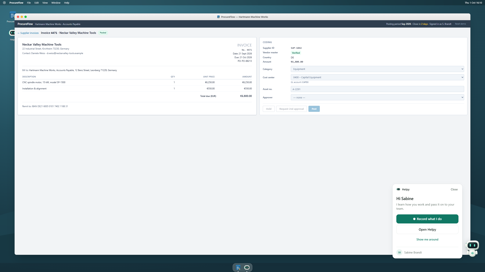
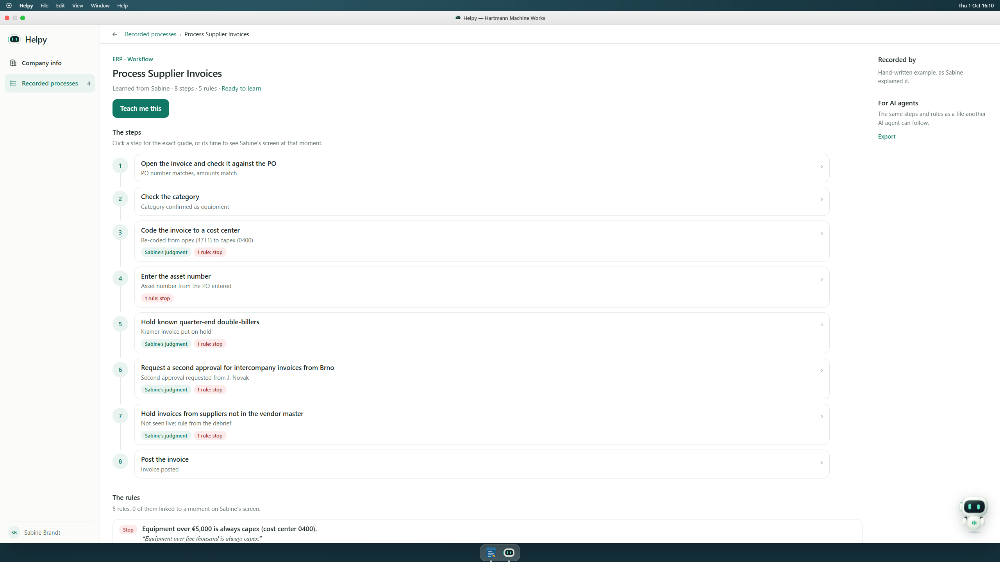
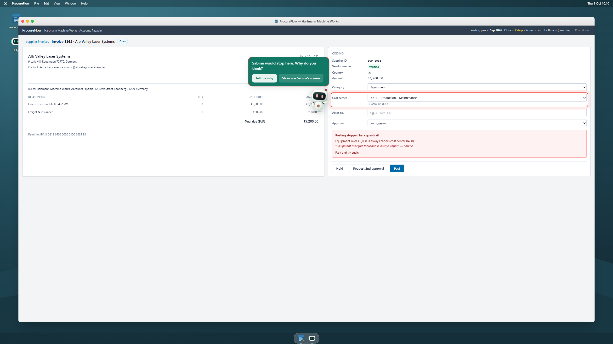
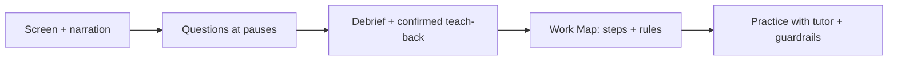

# Helpy

> Learn the steps. Preserve the judgment.

Helpy watches an expert work, listens to their narration, and asks about decisions during natural pauses. It turns the session into a **Work Map**: steps, rules, and the expert's reasons. A new colleague can then practice with guidance that catches mistakes before saving in the included demo ERP.


*Real app recording with synthetic invoice data and the built-in, hand-written example Work Map. The clip shows a guide and Teach guardrails; it does not show live knowledge generation.*

[](LICENSE)


[Installation](#installation) · [Quick start](#quick-start) · [Live demo script](DEMO_SCRIPT.md) · [Architecture](docs/ARCHITECTURE.md)

## Why Helpy?

An experienced employee knows which invoice needs a second approval, which supplier double-bills at quarter-end, and when the usual rule does not apply. A checklist rarely captures that judgment. Writing everything down interrupts the expert, and the document drifts away from the work. Helpy captures the workflow while it happens, asks for missing reasoning, and checks its explanation with the expert before passing it on.

## Features

### Observe

- Record the screen and microphone, with an off-the-record pause.
- Read English and German text locally with Tesseract.js; send redacted screenshots for vision inference.
- Keep a screenshot timeline and narration recording alongside each task.

### Understand

- Ask contextual voice questions during pauses, while avoiding typing and speech.
- Follow up in a debrief, explain the process back, and incorporate expert corrections.
- Ground invoice references against the included ProcureFlow data.

### Learn

- Organize a Work Map into steps, decision trees, rules, and expert quotes.
- Link steps and rules to captured screen moments when recording evidence exists.
- Export a workflow as guidance another AI agent can follow.

### Teach

- Guide a new colleague through unseen practice invoices in ProcureFlow.
- Stop rule-breaking decisions before posting, explain the expert's reason, and point to the relevant field.
- Report independent steps, hints, and mistakes caught during practice.

## Preview

| Start a recording | Work Map |
| --- | --- |
|  |  |

| Decision guide | Teach: mistake caught |
| --- | --- |
|  |  |

*Screenshots are native 2560 × 1440 PNGs. The recording preview shows the entry controls, not an active screen capture. The example has no recorded screen replay. [Media details and reproduction](docs/MEDIA.md).*

## How it works



## Privacy

**Use synthetic data. Helpy currently has public access and a fixed demo identity, without authentication or project authorization.**

OCR and screenshot PII detection run in the browser. Vision receives redacted images, but **original screenshots, original OCR text, and microphone audio are also stored in Convex**. File URLs grant download access to anyone who has them. Audio goes to ElevenLabs for voice features; screen context and workflow content go to Anthropic. Redaction can miss personal information, and speech redaction does not cover names.

Pause stops new capture and pauses microphone recording/Scribe streaming; previously captured items can still finish processing. See [privacy and data handling](docs/PRIVACY.md) and [security reporting](SECURITY.md).

## Installation

Requires **Node.js 22.12+**, npm, and internet for initial dependencies and model downloads.

```sh
git clone https://github.com/maxRN/helpy.git
cd helpy
npm ci
npm run dev:convex
```

When prompted, choose **develop locally without an account**. Keep that terminal running. Convex writes its public URL to ignored `.env.local` and stores local data in `.convex/`.

In a second terminal:

```sh
npm run dev
```

Open [localhost:3000](http://localhost:3000). You can inspect the built-in example workflow and guides without AI credentials. For recording, use desktop Chrome/Edge, select **Entire Screen**, allow the microphone, and wait for OCR/redaction readiness.

### AI and voice configuration

Copy `.env.example` to `.env`. Set `ANTHROPIC_API_KEY` and `ELEVENLABS_API_KEY`, then configure the voice agents:

```sh
node scripts/create-elevenlabs-agents.mjs
```

Save the returned interviewer/tutor IDs in `.env` and restart the app. This script creates or updates agents in your ElevenLabs account; API usage may incur charges. Optional voice/model overrides are listed in [.env.example](.env.example). Keep server keys out of `VITE_` variables and Git. [Detailed setup and deployment](docs/ARCHITECTURE.md).

## Quick start

| Do this | What happens |
| --- | --- |
| Open Helpy → Recorded processes → Process Supplier Invoices | Inspect the hand-written example, its steps, and its rules. |
| Open a step | Read the guide and decision tree; real recordings can also replay screen moments. |
| Click the robot → Record what I do | Request screen/microphone access and start a new recording once models are ready. |
| Work through an invoice and explain decisions aloud | Helpy observes changes and asks during pauses. |
| Click the robot → I'm done | Finish capture, then clarify missing reasoning and confirm the teach-back. |
| Open the process → Teach me this | Practice with guided steps and guardrails in ProcureFlow. |
| Try posting invoice 5102 with cost center 4711 | The example rule blocks the €7,200 equipment invoice; it needs capex coding. |

For the full Capture → Map → Teach walkthrough and fallback procedure, see [DEMO_SCRIPT.md](DEMO_SCRIPT.md).

## Architecture

The browser coordinates capture, local OCR/redaction, the mascot, and ProcureFlow. TanStack Start server routes call Anthropic and ElevenLabs. Convex stores projects, tasks, screenshot/audio files, events, and Work Maps. Teach applies the workflow's rules to the demo's practice invoices.

React 19 · TypeScript · TanStack Start/Router/Query · Vite · Tailwind CSS · Convex · Anthropic · ElevenLabs · Tesseract.js · Desert Ant Labs Redact / LiteRT.

[Full architecture and integration contracts](docs/ARCHITECTURE.md) · [Screenshot pipeline benchmark](docs/screenshot-pipeline-benchmark.md)

## Development

```sh
npm run typecheck
npm test
npm run build
```

Helpy is a hackathon project centered on synthetic accounts-payable workflows. Guardrails run inside ProcureFlow; they do not intercept arbitrary external software. Live recording and voice depend on permissions, model downloads, and provider availability. Production use needs authentication, authorization, and a reviewed data-handling policy.

## Contributing

Focused fixes, clearer guides, and reproducible bug reports are welcome. Read [CONTRIBUTING.md](CONTRIBUTING.md) for setup, validation, and where changes belong. Report sensitive issues through the process in [SECURITY.md](SECURITY.md).

## License

Helpy's own code is [MIT licensed](LICENSE). Dependencies and model weights retain their respective licenses. Redact is source-available; see [THIRD_PARTY_NOTICES.md](THIRD_PARTY_NOTICES.md).
